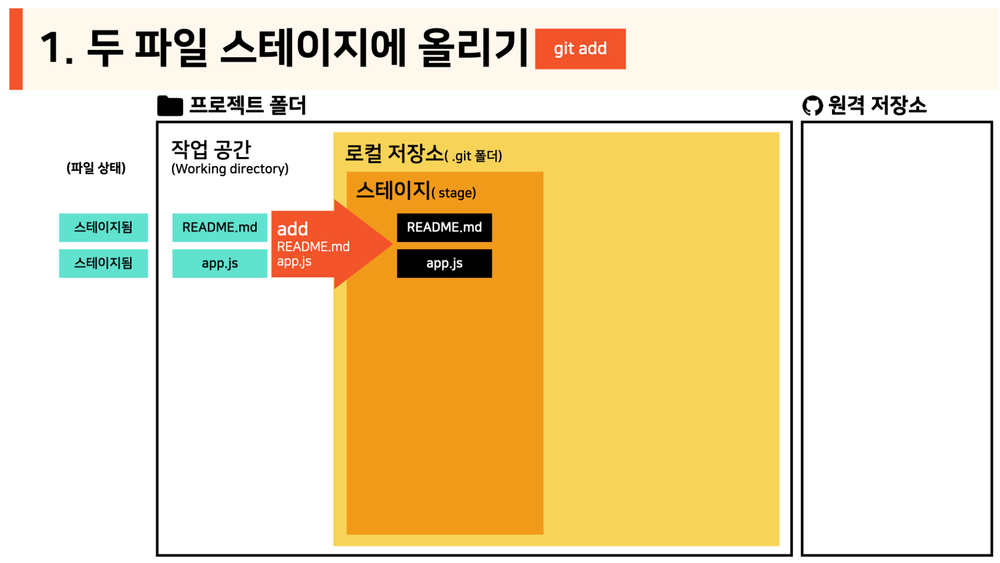
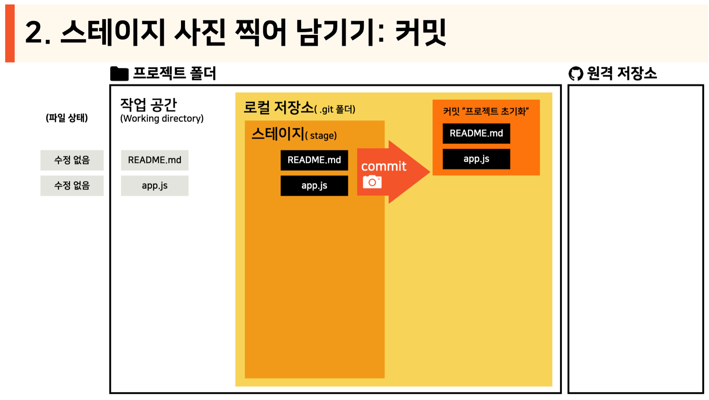
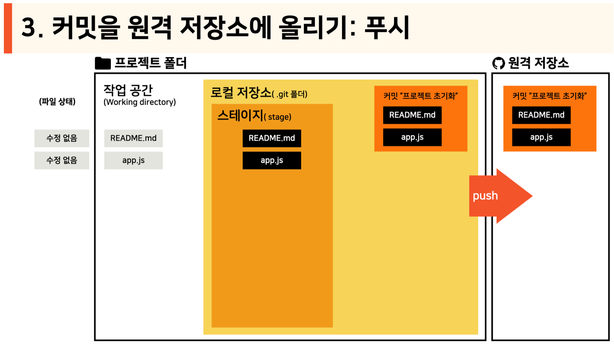

# 깃 사용법

## 깃 환경설정
```bash
git config --global user.name "닉네임"
git config --global user.email "이메일 주소"
git config --list
```

## 1. 처음 올리기
1. 스테이징
컴퓨터의 폴더에서
```bash
git init
git add .
```
<!-- add에 관련된 이미지 -->


2. 커밋 (Github에 올릴준비 하기)
```bash
git commit -m "메시지"
```


3. 브랙치 설정 및 remote origin 더하기
```
git branch -M <master 또는 main>
git remote add origin <https://깃허브 주소.git>
```
유저 이름: GrandChampion
패스워드: 토큰 hash

4. push 하기
```bash
git push -u origin <master 또는 main>
```


---

## 2. Github에서 가져오기
로컬 컴퓨터에 clone할 위치에 가서
```bash
git clone <https://깃허브 주소.git>
```
---
## 3. 있던 상태에서 올리기 (Github에 업데이트)
```bash
git add .
git commit -m "메시지"
git push -u origin <master 또는 main>
```
---

## 4. 다른 브랜치에서 소스코드를 받아오기
```bash
git pull origin <브랜치명: master 등>
```
---

## 5. 브랜치 관련

### 5.1 브랜치 나열
```bash
git branch
```

### 5.2 새로운 로컬 브랜치 만들기
```bash
git branch <브랜치명>
```

### 5.3 브랜치 변경하기
```bash
git checkout <브랜치명>
```

### 5.4 다른 브랜치에서 변경한것 병합하기
```bash
git checkout <브랜치명: master 등>
git merge <변경된 브랜치명>
```

### 5.5 브랜치 삭제
```bash
git branch -d <브랜치명>
```

---